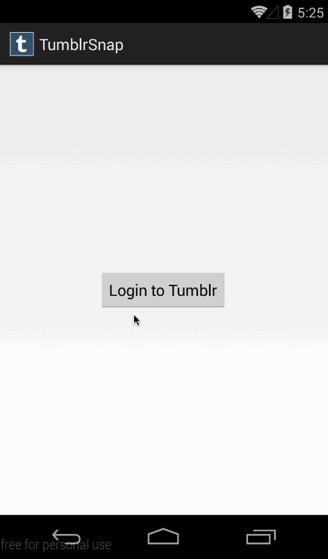

tumblrsnap
==========

A fun photos app built on Tumblr. Used for our CodePath bootcamp.

Time spent: 5 hours

Completed user stories:

- [x] User can sign in using OAuth login flow
- [x] User can view global feed of photos created by any TumblrSnap client
- [x] User can take a picture, apply a filter, and upload that image to tumblr
 - [x] User can select a photo from camera roll, apply a filter and post
 - [x] User can select between multiple photo filters such as blur, grey, sepia
- [] Theme and style the app for a pleasant UI and UX experience
- [x] Use a drop-down menu group from the ActionBar for logging out
- [] Stretch: User can attach a location to every photo (geotag) 

###Notes

Stretch assignment is not possible with current Tumblr API

###Walkthrough of all user stories:

  

GIF created with [LiceCap](http://www.cockos.com/licecap/).
